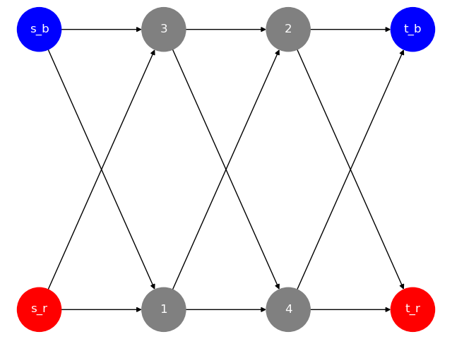

# Introduction

The multi-commodity flow problem is a network flow problem with multiple commodities. Given a directed graph and a set of commodities, the goal is to find a flow for each edge and each commodity such that the flow satisfies the capacity constraints of the edges and the conservation of flow at each node. Even though the demands are different, the capacities of the edges are often shared between the commodities, which poses a challenge in finding a feasible solution.

In the example above, we have a directed graph with two commodities which are represented by two sets of source and sink nodes: red and blue.

The multi-commodity flow problem can are applicable in various domains such as transportation, telecommunication, and logistics. For example:
- In transportation, the multi-commodity flow problem can be used to model the fact that multiple different vehicles are traveling on the same road network. The utilization of the road network is different between buses, cars, and trucks due to their different sizes and weights.
- In telecommunication, the multi-commodity flow problem can be used to model the fact that different types of data are transmitted over the same network. The bandwidth requirements of video, audio, and text data are all different due to their different sizes, formats and consumption patterns.

In 2021, [Liu et al](https://doi.org/10.48550/arXiv.2108.07549) proposed a localized solution method for the multi-commodity flow problem. The method is a combinatorial algorithm that are localized in the sense that it looks at each edge and node in isolation at each iteration. Furthermore, the authors showed that the algorithm will always converge to an optimal solution if it exists. As such the algorithm promises an exact solution for the multi-commodity flow problem that is also highly parallelizable, which is worth exploring.
