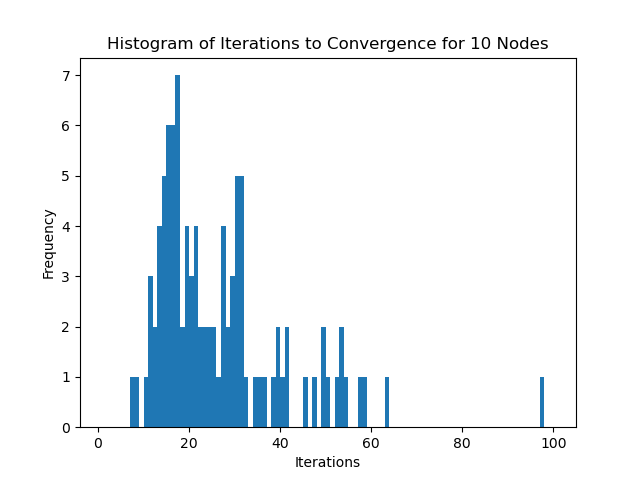
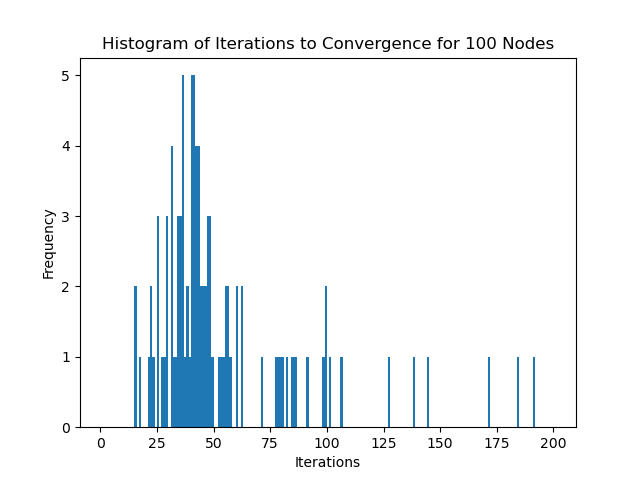
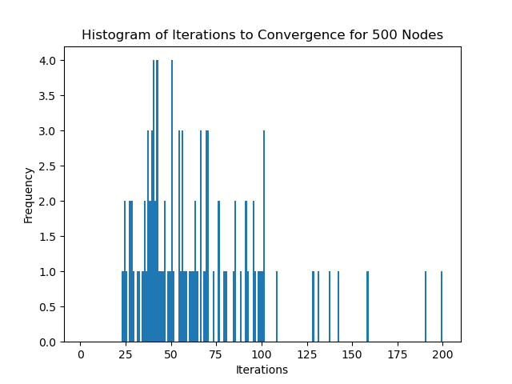
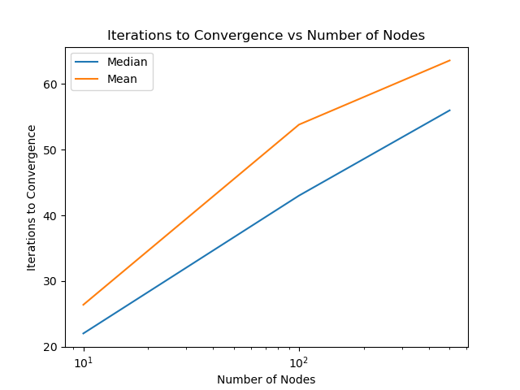

# Testing

We test to see if the complexity of the algorithm devised by [Liu et al](https://doi.org/10.48550/arXiv.2108.07549) as expected.

In this section, we will generate random directed Erdős-Rényi graphs and use the algorithm on them to see if the number of iterations required for convergence is similar to the theoretical complexity:

> We give an algorithm with complexity 
> \\[
> O\left( K |E| \frac{\lambda_{\text{max}}}{\alpha} \ln \frac{\Lambda \sum_{k \in \mathcal{K}} d_k}{\epsilon \alpha} \right)
> \\]
> for the multicommodity flow problem, where \\(\Lambda\\) is the maximum degree of graph \\(G(V, E)\\) and \\(\lambda_{\text{max}}\\) the largest eigenvalue of \\(Q^T Q\\) (see Expression 13).

The test is implemented in Python and can be found in the [scripts folder of the repository](https://github.com/nthieu173/localized-multicommodity-flow/blob/main/src/scripts/algorithm_convergence_histogram.py)

## 10 Nodes with 30% Edge Density

This works out to around:
\\[
0.3 \times 10 \times 9 = 27 \text{ edges}
\\]

## 100 Nodes with 3% Edge Density

This works out to around:
\\[
0.03 \times 100 \times 99 = 297 \text{ edges}
\\]

## 500 Nodes with 0.6% Edge Density

This works out to around:
\\[
0.006 \times 500 \times 499 = 1497 \text{ edges}
\\]

## Observations

We see that in practice, the number of iterations required for convergence doesn't actually scale according to the number of edges in the graph. This is likely due to the fact that the complexity also depends on the maximum degree of the graph. In these examples, to not take too long, I've purposefully created sparser graphs as the number of nodes increases, which will decrease the maximum degree of the graph, keeping the number of iterations relatively constant despite the increase in the number of edges.
